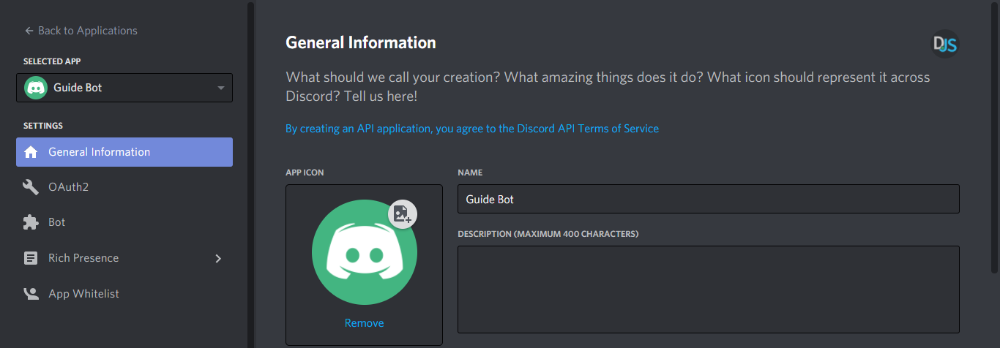
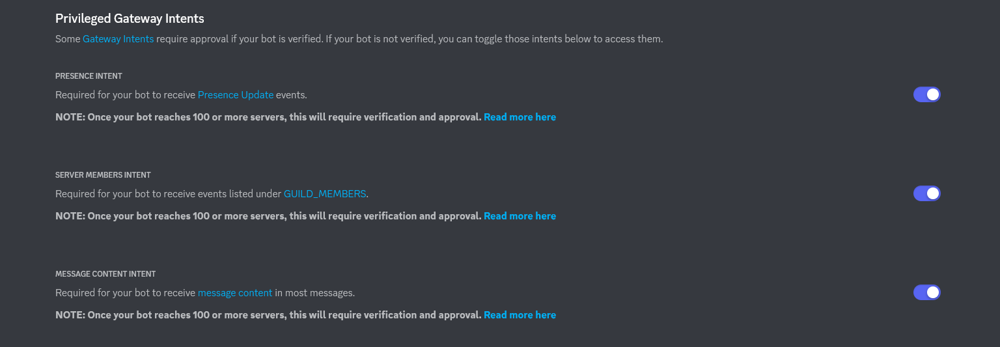
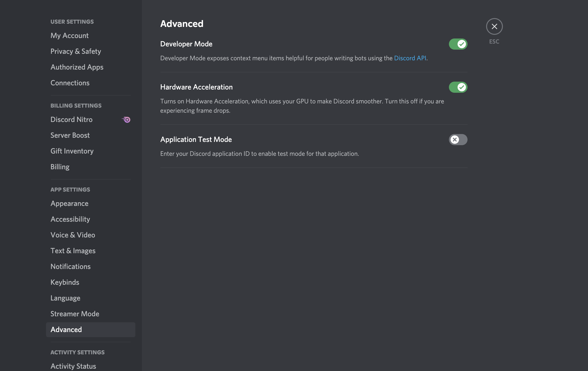

# Bounty Bot

This is the Discord bot application for the Bankless DAO Bounty Board.

# Install

The Discord bot develop is platform agnostic. It can be installed locally on Windows, or unix systems where the Discord
application is available.

These tools can make development quick and are recommended:

-   [git CLI](https://git-scm.com) - version control system
-   [nodejs >=16.10.0](https://nodejs.org/en/) - js runtime built on chrome's v8 engine
-   [nvm](https://github.com/nvm-sh/nvm) - easily change node versions
-   [yarn v1.x](https://yarnpkg.com/) - dependency management system
-   [Docker](https://docs.docker.com/desktop/) - for local development
-   [iterm2](https://iterm2.com/) - enhanced terminal for macOS
-   [discord](https://discord.com/) - popular chat application used for gaming and organized communities

## Configuration Setup

Before the bot is ready to run there are a few configuration items that should be done. First few steps can be done following
the [discord.js guide](https://discordjs.guide/#before-you-begin);

### 1. Create environment file

Copy .env.template to .env

Below is a description of these env vars:

```
DISCORD_BOT_TOKEN=<taken from discord bot application page>
DISCORD_BOT_PUBLIC_KEY=<taken from discord application PUBLIC KEY>
DISCORD_BOT_APPLICATION_ID=<taken from discord application APPLICATION ID>

TEST_CUSTOMER=<Discord server ID if your server is not in the CustomerIds constant list>

NODE_ENV=development

MONGODB_URI=<mongodb URI for your mongodb install>

LOGDNA_APP_NAME=<you choose, but it's the application that will show up in LOGDNA>
LOGDNA_DEFAULT_LEVEL=debug
LOGDNA_TOKEN=<Ingestion key from the Settings > Organization > API console of LOGDNA>

BOUNTY_BOARD_URL=<URL of the Bounty Board website>
BOUNTY_BOARD_HELP_URL=https://www.notion.so/bankless/Bounty-Board-Help-aa6d0d679a2f4266872a20e376a59c9d
```

### 2. Create Discord bot application

[https://discordjs.guide/preparations/setting-up-a-bot-application.html](https://discordjs.guide/preparations/setting-up-a-bot-application.html)
Create your own discord application and then create a bot in that application to get your own bot API key.

Retrieve the bot application's Application ID and Public Key


Create the bot user and retrieve the token


Put these into your .env file (see above)

Give your bot all Intents privileges



### 3. Invite your bot to your personal discord with correct permissions

[https://discordjs.guide/preparations/adding-your-bot-to-servers.html#bot-invite-links](https://discordjs.guide/preparations/adding-your-bot-to-servers.html#bot-invite-links)

Go to the OAuth2->URL Generator, and select the following permissions:

#### OAuth2/Scopes
- bot
- applications.commands

#### General Permissions
- Manage Roles
- Manage Channels
- Kick Members
- Ban Members
- Manage Emojis and Stickers
- Manage Webhooks
- View Channels

#### Text Permissions
- Send Messages
- Public Threads
- Private Threads
- Send Messages in Threads
- Manage Messages
- Manage Threads
- Embed Links
- Read Message History
- Mention Everyone
- Add Reactions
- Use Slash Commands

Copy the URL generated at the bottom of your page and paste this into a browser

### 4. Enable Developer Mode

There should be a small cog near your icon photo labeled "User Settings". Hitting that there should be an option to enable
developer mode


 ### 5. Mongo DB Configuration
 
 Refer to the Bounty Board web application [README](https://github.com/BanklessDAO/bounty-board), including the instructions for setting up your customer record in the Customers collection
 
 Put the MongoDB URI into your .env file (see above)

### 6. Create LogDNA Account (optional)

Start a free trial.
If you do not mind about retaining logs (not necessary for local development), the service will always stay free.
On the right most panel go to Settings > Organization > API Keys
Copy an ingestion key. Set that value as LOGDNA_TOKEN in your .env

### 6. Run application

If not using docker:
```bash
yarn start
```

If using docker:
```bash
docker-compose up
```

